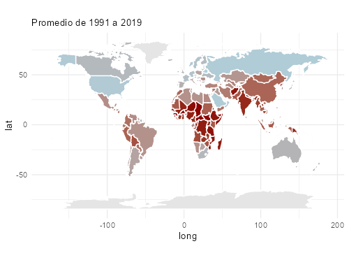
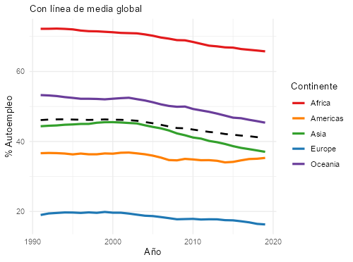
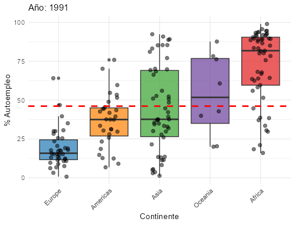
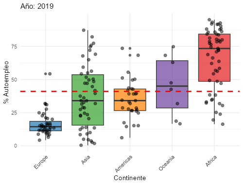
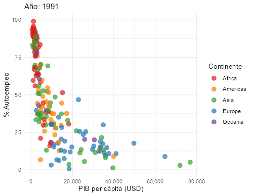
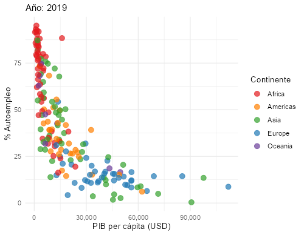

```{r setup, include=FALSE}
knitr::opts_chunk$set(echo = TRUE, warning = FALSE, message = FALSE, fig.width = 8, fig.height = 8)
```


```{r echo=FALSE}
# Instalar y cargar librerías necesarias
paquetes <- c(
  "readr", "haven", "dplyr", "tidyr", "countrycode",
  "flexdashboard", "tidyverse", "shiny", "maps",
  "DT", "ggplot2", "rmarkdown", "forcats", "knitr"
)

for(p in paquetes){
  if(!require(p, character.only = TRUE)){
    install.packages(p, dependencies = TRUE)
    library(p, character.only = TRUE)
  }
}
```


```{r echo=FALSE}
#cargar datos
dat_base <- read.csv("../datos/data_base.csv")
```

## Introducción

El estudio del **autoempleo** permite comprender dimensiones clave de las dinámicas laborales y su relación con el contexto socioeconómico. Analizar cómo ha evolucionado el porcentaje de *trabajadores por cuenta propia* en distintos países entre **1991 y 2019**, con información obtenida de [Gapminder](https://www.gapminder.org), ofrece una visión sobre cambios estructurales en el mercado de trabajo y posibles diferencias culturales entre regiones. Asimismo, observar qué continentes presentan las tasas más altas de autoempleo a lo largo del tiempo ayuda a identificar **patrones globales** y *desigualdades regionales*.  

**Figura 1: Promedio del porcentaje de trabajadores autónomos en el mundo**  
{width=400px}

Más allá de las tendencias temporales y geográficas, resulta relevante explorar si el autoempleo guarda relación con **indicadores económicos** como el *PIB per cápita*. Esto permitiría interpretar si se trata de una opción vinculada a la *precariedad laboral* o, por el contrario, a **oportunidades de desarrollo económico**. En conjunto, estas preguntas guían el análisis y orientan la visualización de datos, proporcionando una base sólida para reflexionar sobre el papel del autoempleo en la **estructura social y laboral contemporánea**.  

El análisis y visualización buscan responder las siguientes preguntas clave:  

- **¿Qué regiones o continentes presentan mayores tasas de autoempleo a lo largo del tiempo?**  
- **¿Cómo ha evolucionado el porcentaje de trabajadores por cuenta propia en distintos países desde 1991?**  
- **¿Existen correlaciones entre el nivel de autoempleo y variables socioeconómicas como el PIB per cápita?**  
- **¿Qué diferencias se observan entre continentes en cuanto a la proporción de trabajadores autónomos?**  

Estas preguntas guían el diseño del *dashboard*, asegurando que cada gráfico aporte información relevante y complementaria para una exploración analítica de calidad y contextualizada que exploraremos en este informe.


## Evolución temporal del autoempleo

**Figura 2: Línea temporal del porcentaje de trabajadores autónomos por continentes**  
{width=400px}
```{r echo=FALSE}
# Tabla resumen en formato ancho
tabla_resumen_ancho <- dat_base %>%
  filter(year %in% c(1991, 2001, 2011, 2019)) %>%
  group_by(continent, year) %>%
  summarise(
    autoempleo_prom = mean(self_employed_perc, na.rm = TRUE),
    .groups = "drop"
  ) %>%
  pivot_wider(
    names_from = year,
    values_from = autoempleo_prom
  ) %>%
  rename(y1991 = `1991`, y2001 = `2001`, y2011 = `2011`, y2019 = `2019`)

# Mostrar la tabla
kable(tabla_resumen_ancho, caption = "Tabla 1: Porcentaje de autoempleo (%) por continente y año")
```

El análisis de la evolución temporal del autoempleo en los diferentes continentes (años **1991-2019**) muestra patrones claramente diferenciados:

- **África** mantiene consistentemente los valores más altos de autoempleo, aunque presenta una tendencia descendente, pasando de *`r round(tabla_resumen_ancho$y1991[tabla_resumen_ancho$continent=="Africa"], 1)`% en 1991* a *`r round(tabla_resumen_ancho$y2019[tabla_resumen_ancho$continent=="Africa"], 1)`% en 2019*.  
- **América** se mantiene relativamente estable en torno al *35%*, sin cambios drásticos a lo largo del periodo.  
- **Asia** presenta una ligera subida en 2001 (*`r round(tabla_resumen_ancho$y2001[tabla_resumen_ancho$continent=="Asia"], 1)`%*), seguida de un descenso sostenido hasta llegar a *`r round(tabla_resumen_ancho$y2019[tabla_resumen_ancho$continent=="Asia"], 1)`% en 2019*.  
- **Europa** refleja los niveles más bajos en todos los años analizados, con una reducción de *`r round(tabla_resumen_ancho$y1991[tabla_resumen_ancho$continent=="Europe"], 1)`% en 1991* a *`r round(tabla_resumen_ancho$y2019[tabla_resumen_ancho$continent=="Europe"], 1)`% en 2019*.  
- **Oceanía** muestra también un descenso claro, desde *`r round(tabla_resumen_ancho$y1991[tabla_resumen_ancho$continent=="Oceania"], 1)`% en 1991* hasta *`r round(tabla_resumen_ancho$y2019[tabla_resumen_ancho$continent=="Oceania"], 1)`% en 2019*.  

Para facilitar la visualización y comprensión de los datos, a continuación se presenta una **tabla resumen con los valores promedio por década** (1991, 2001, 2011 y 2019). Esto permite concentrarse en los cambios principales sin sobrecargar la tabla con todos los años disponibles.


## Diferencias entre continentes

**Figura 3: Boxplot de trabajadores autónomos por continentes (1991)**
{width=400px}

**Figura 4: Boxplot de trabajadores autónomos por continentes (2019)**
{width=400px}

## Diferencias entre continentes

El análisis comparativo por continentes revela **patrones claros y diferenciados** en los niveles de autoempleo entre 1991 y 2019:

- **África:** mantiene consistentemente los valores más altos de autoempleo, aunque se observa una **ligera disminución** en los últimos años. La dispersión de los países indica **heterogeneidad notable**, con algunos países con tasas muy elevadas y otros más moderadas.  

- **Oceanía:** nivel intermedio, con **tendencia descendente más marcada** que África y ligera reducción de la variabilidad en 2019.  

- **Asia:** valores medianos, que **disminuyen visiblemente** a lo largo del periodo. La dispersión sigue siendo considerable, indicando **diferencias estructurales** entre países.  

- **América:** niveles **moderados y bastante estables**, con pocas variaciones en la dispersión, reflejando **uniformidad relativa**.  

- **Europa:** tasas más bajas, con **medianas bajas y poca dispersión**, evidenciando **mercados laborales más formalizados** y estructurados.  

En conjunto, los **boxplots por continente** permiten visualizar no solo los valores promedio, sino también la **dispersión y la presencia de valores atípicos**, destacando que **África y Asia presentan mayor heterogeneidad**, mientras que **Europa es más uniforme**.  

La comparación entre 1991 y 2019 muestra una **tendencia global decreciente del autoempleo**, con descensos más acentuados en África, Oceanía y Asia, mientras América y Europa mantienen mayor estabilidad. Este análisis resalta **diferencias estructurales entre continentes**, reflejando tanto la organización del mercado laboral como factores socioeconómicos que pueden influir en la elección o necesidad del autoempleo.

## Relación autoempleo y PIB per cápita

Para explorar la relación entre el porcentaje de **trabajadores por cuenta propia** y el *PIB per cápita* de los países, se presentan scatterplots correspondientes a los años **1991** y **2019**.

**Figura 5. Scatterplot: % de trabajadores autónomos vs PIB per cápita (1991)**  
{width=400px}

**Figura 6. Scatterplot: % de trabajadores autónomos vs PIB per cápita (2019)**  
{width=400px}

```{r echo=FALSE}
# Tabla resumen por país y año
tabla_resumen <- dat_base %>%
  group_by(continent) %>%
  summarise(
    autoempleo_prom = mean(self_employed_perc, na.rm = TRUE),
    pib_prom = mean(gdp, na.rm = TRUE)
  ) %>%
  arrange(continent)

# Mostrar la tabla
kable(tabla_resumen, caption = "Tabla 2: Autoempleo vs. PIB")
```

Del análisis visual se pueden extraer algunas observaciones clave:

El análisis de los datos revela una **relación logaritmica decreciente** entre el porcentaje de **trabajadores autónomos** y el *PIB per cápita* a nivel continental. En general, los países con un mayor porcentaje de autoempleo tienden a presentar un PIB más bajo, mientras que los países con menor proporción de trabajadores por cuenta propia muestran niveles de PIB más elevados.

Tomando como referencia los **promedios por continente** (Tabla 2), se observan patrones consistentes con esta tendencia:

- **África** presenta el mayor porcentaje de autoempleo (*`r round(tabla_resumen$autoempleo_prom[tabla_resumen$continent=="Africa"], 1)`%*) y un PIB promedio relativamente bajo (*`r round(tabla_resumen$pib_prom[tabla_resumen$continent=="Africa"], 1)` USD*), lo que sugiere que el autoempleo podría estar ligado en gran medida a la **precariedad laboral** o a la falta de empleo formal.  
- **Europa**, por el contrario, tiene el porcentaje más bajo de trabajadores autónomos (*`r round(tabla_resumen$autoempleo_prom[tabla_resumen$continent=="Europe"], 1)`%*) y el PIB promedio más alto(`r format(round(tabla_resumen$pib_prom[tabla_resumen$continent=="Europe"], 0), big.mark=".")`) , reflejando economías más consolidadas con mercados laborales formales.  
- **América** y **Asia** muestran valores intermedios: América con *`r round(tabla_resumen$autoempleo_prom[tabla_resumen$continent=="Americas"], 1)`%* de autoempleo y un PIB promedio de *`r format(round(tabla_resumen$pib_prom[tabla_resumen$continent=="Americas"], 0), big.mark=".")` USD*, Asia con *`r round(tabla_resumen$autoempleo_prom[tabla_resumen$continent=="Asia"], 1)`%* y *`r format(round(tabla_resumen$pib_prom[tabla_resumen$continent=="Asia"], 0), big.mark=".")` USD*.  
- **Oceanía** es un caso particular, con un porcentaje de autoempleo relativamente alto (*`r round(tabla_resumen$autoempleo_prom[tabla_resumen$continent=="Oceania"], 1)`%*) pero un PIB promedio moderadamente elevado (*`r format(round(tabla_resumen$pib_prom[tabla_resumen$continent=="Oceania"], 0), big.mark=".")` USD*), lo que podría indicar que en algunos contextos el autoempleo no necesariamente se asocia a bajos ingresos, sino a oportunidades económicas específicas o estructuras laborales flexibles.

Estos datos permiten **visualizar y cuantificar** la tendencia observada en los scatterplots: a nivel global, el autoempleo tiende a ser más alto en regiones con menor desarrollo económico y más bajo en continentes con mayor PIB per cápita. Esta información es clave para interpretar patrones sociales y económicos, y para guiar análisis posteriores que exploren factores culturales, sectoriales o institucionales que modulan la relación entre autoempleo y desarrollo económico.


## Conclusiones

1. El porcentaje de **trabajadores por cuenta propia** varía significativamente entre continentes. África mantiene los valores más altos, mientras que Europa presenta los más bajos, reflejando diferencias estructurales y culturales en el mercado laboral.  

2. La **evolución temporal (1991–2019)** muestra tendencias claras: África y Oceanía presentan una ligera disminución, Asia tuvo un pico en 2001 seguido de descenso, y Europa se mantiene estable con valores bajos. Esto indica cambios graduales en la dinámica del autoempleo a lo largo del tiempo.  

3. Existe una **relación decreciente entre autoempleo y PIB per cápita**: los países con mayor porcentaje de autónomos tienden a tener un PIB más bajo, mientras que aquellos con menor autoempleo muestran un PIB elevado. África ejemplifica este patrón, y Europa el caso contrario.  

4. Aunque la relación general es consistente, algunos continentes como Oceanía muestran que un porcentaje alto de autoempleo no siempre se asocia a PIB bajos, sugiriendo que factores culturales, sectoriales o económicos específicos también influyen.  

5. Estos hallazgos destacan la importancia de combinar análisis **temporal, geográfico y económico** para comprender las dinámicas del autoempleo y orientar futuras investigaciones o políticas públicas en materia laboral.


## Conclusiones

- **Variación entre continentes:** África con mayor autoempleo, Europa con menor → diferencias estructurales y culturales.  

- **Evolución temporal (1991–2019):** África y Oceanía disminuyen ligeramente, Asia tuvo pico en 2001 seguido de descenso, Europa estable y baja.  

- **Relación autoempleo vs PIB:** países con más autónomos suelen tener PIB más bajo; África ejemplifica esto, Europa el caso contrario.  

- **Excepciones:** Oceanía muestra que autoempleo alto no siempre significa PIB bajo → influyen factores culturales, sectoriales o económicos.  

- **Importancia del análisis combinado:** temporal, geográfico y económico para entender dinámicas del autoempleo y guiar políticas laborales.


