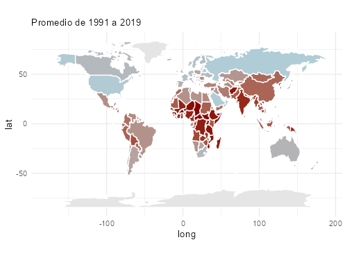
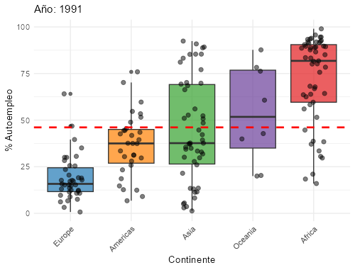

```{r setup, include=FALSE}
knitr::opts_chunk$set(echo = TRUE, warning = FALSE, message = FALSE)
```

```{r echo=FALSE}
# Instalar y cargar librerías necesarias
paquetes <- c(
  "readr", "haven", "dplyr", "tidyr", "countrycode", "tidyverse", "shiny",
  "DT", "rmarkdown", "forcats", "knitr"
)

for(p in paquetes){
  if(!require(p, character.only = TRUE)){
    install.packages(p, dependencies = TRUE)
    library(p, character.only = TRUE)
  }
}
```

```{r echo=FALSE}
#cargar datos
dat_base <- read.csv("../datos/data_base.csv")
```

## Índice

<ol>
  <li> Introducción</li>
  <li> Evolución temporal del autoempleo</li>
  <li> Diferencias entre continentes</li>
  <li> Relación autoempleo y PIB per cápita</li>
  <li> Conclusiones</li>
</ol>


## 1. Introducción

**Objetivo del estudio:**  
Comprender las dinámicas del **autoempleo** y su relación con el contexto socioeconómico (1991-2019).

**Preguntas clave:**  
- ¿Qué regiones presentan mayores tasas de autoempleo?  
- ¿Cómo ha evolucionado el autoempleo en distintos países?  
- ¿Existe relación con el *PIB per cápita*?  
- ¿Qué diferencias hay entre continentes?

| {width=350px} |
|:--:|
| Figura 1. Distribución global del autoempleo |


```{r echo=FALSE, results='hide'}
# Tabla resumen en formato ancho
tabla_resumen_ancho <- dat_base %>%
  filter(year %in% c(1991, 2001, 2011, 2019)) %>%
  group_by(continent, year) %>%
  summarise(
    autoempleo_prom = mean(self_employed_perc, na.rm = TRUE),
    .groups = "drop"
  ) %>%
  pivot_wider(
    names_from = year,
    values_from = autoempleo_prom
  ) %>%
  rename(y1991 = `1991`, y2001 = `2001`, y2011 = `2011`, y2019 = `2019`)
```


## 2. Evolución temporal del autoempleo
| {width=350px} |
|:--:|
| Figura 2. Línea temporal por continentes |
- Muestra la evolución del **autoempleo** (1991-2019) en cada continente.
- Con la media global representada con la línea discontinua


## 2. Principales patrones (evolución temporal)
- **África:** valores más altos, tendencia descendente (≈`r round(tabla_resumen_ancho$y1991[tabla_resumen_ancho$continent=="Africa"],1)`% → `r round(tabla_resumen_ancho$y2019[tabla_resumen_ancho$continent=="Africa"],1)`%)  
- **América:** estable alrededor de 35%  
- **Asia:** subida en 2001 (`r round(tabla_resumen_ancho$y2001[tabla_resumen_ancho$continent=="Asia"],1)`%), luego descenso hasta `r round(tabla_resumen_ancho$y2019[tabla_resumen_ancho$continent=="Asia"],1)`%  
- **Europa:** niveles más bajos, descenso de `r round(tabla_resumen_ancho$y1991[tabla_resumen_ancho$continent=="Europe"],1)`% → `r round(tabla_resumen_ancho$y2019[tabla_resumen_ancho$continent=="Europe"],1)`%  
- **Oceanía:** descenso claro (`r round(tabla_resumen_ancho$y1991[tabla_resumen_ancho$continent=="Oceania"],1)`% → `r round(tabla_resumen_ancho$y2019[tabla_resumen_ancho$continent=="Oceania"],1)`%)


## 3. Diferencias entre continentes
| {width=300px} | {width=300px} |
|:--:|:--:|
| Figura 3: Boxplot Continentes 1991 | Figura 4: Boxplot Continentes 2019 |


## 3. Diferencias entre continentes

- **África** → los valores más altos de autoempleo.  
- **Oceanía** → niveles intermedios, pero con **descenso claro**.  
- **Asia** → valores medianos, con bastante **variabilidad entre países**.  
- **América** → niveles **moderados y estables**.  
- **Europa** → las tasas más bajas, con **poca dispersión**.  

Los **boxplots** muestran que **África y Asia** son los continentes con mayor **heterogeneidad**,  
mientras que **Europa** es el más **uniforme**.


## 4. Relación autoempleo y PIB per cápita

| {width=300px} | {width=300px}|
|:--:|:--:|
| Figura 5. Scatterplot: % de trabajadores autónomos vs PIB per cápita (1991) | Figura 6. Scatterplot: % de trabajadores autónomos vs PIB per cápita (2019) |


## 4. Relación autoempleo y PIB per cápita
```{r echo=FALSE}
# Tabla resumen por país y año
tabla_resumen <- dat_base %>%
  group_by(continent) %>%
  summarise(
    autoempleo_prom = mean(self_employed_perc, na.rm = TRUE),
    pib_prom = mean(gdp, na.rm = TRUE)
  ) %>%
  arrange(continent)

# Mostrar la tabla
kable(tabla_resumen, caption = "Tabla 2: Autoempleo vs. PIB")
```

## 4. Relación Autoempleo vs PIB per cápita
<div style="font-size:80%">
Existe una **relación decreciente**: más autónomos → PIB bajo.  

- **África:** mayor porcentaje de autoempleo y PIB bajo → posible relación con **precariedad laboral**.  
- **Europa:** menor autoempleo y PIB alto → **economías consolidadas y mercados formales**.  
- **América y Asia:** valores intermedios de autoempleo y PIB.  
- **Oceanía:** autoempleo relativamente alto y PIB moderado → puede reflejar **oportunidades económicas específicas**.

El autoempleo tiende a ser más alto en regiones con menor desarrollo económico y más bajo en continentes con mayor PIB, destacando patrones socioeconómicos y estructurales.
</div>

## 5. Conclusiones
<div style="font-size:80%">
- **Variación entre continentes:** África con mayor autoempleo, Europa con menor → diferencias estructurales y culturales.  

- **Evolución temporal (1991–2019):** África y Oceanía disminuyen ligeramente, Asia tuvo pico en 2001 seguido de descenso, Europa estable y baja.  

- **Relación autoempleo vs PIB:** países con más autónomos suelen tener PIB más bajo; África ejemplifica esto, Europa el caso contrario.  

- **Excepciones:** Oceanía muestra que autoempleo alto no siempre significa PIB bajo → influyen factores culturales, sectoriales o económicos.  

- **Importancia del análisis combinado:** temporal, geográfico y económico para entender dinámicas del autoempleo y guiar políticas laborales.
</div>
